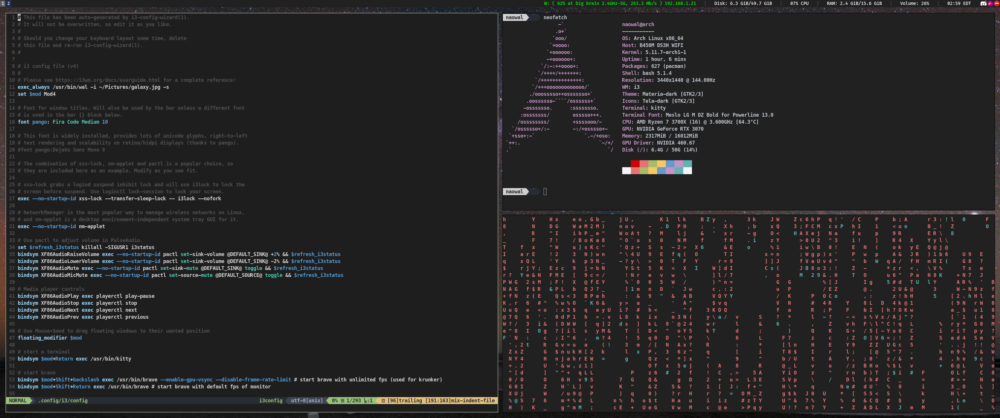
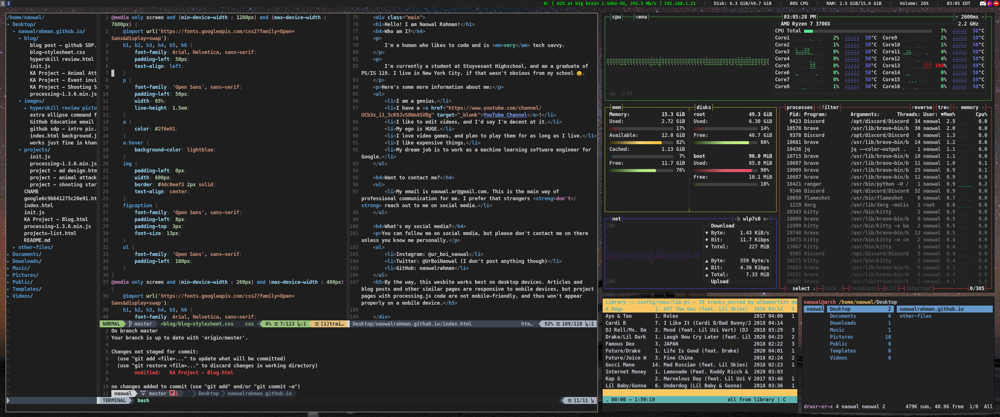
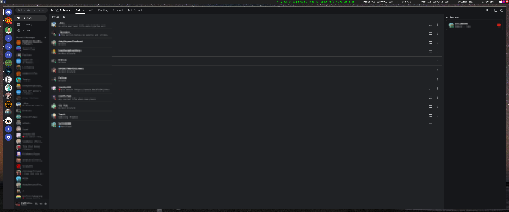

# dotfiles
These are my current dotfiles for Arch Linux with i3wm as the window manager. 

Whenever I make any major change to my dotfiles, I'll be reflecting those changes in this repository. 

### Apps used: 
- system monitor: bpytop
- browser: Brave
- music player: cmus
- notification manager: dunst 
- screenshot tool: flameshot
- camera app: guvcview
- wm: i3-gaps
- terminal emulator: kitty
- media player: mpv
- compositor: picom 
- file manager: ranger
- pdf viewer: zathura 
- gtk theme: materia dark 
- text editor: neovim

(Note that to use my neovim config, you need the [neovim-nightly-bin](https://aur.archlinux.org/packages/neovim-nightly-bin) version of neovim from the AUR.)

I've started experimenting with dwm on a virtual machine, and once I fully switch to it I will upload my rice of that, but for now, this is my main configuration. 

### Screenshots:

