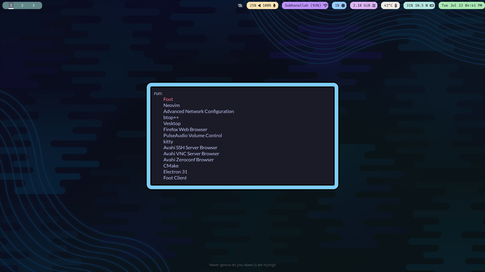

# Dotfiles

These are my dotfiles for Arch Linux with i3wm. 

## Programs
* WM: `i3wm`
* Font: `FiraCode Nerd Font`
* Shell: `zsh` with `zinit` and `tmux`
* Prompt: `pure`
* Terminal emulator: `kitty`
* Editor: `neovim`
* Launcher: `rofi`
* System info tool: `neofetch`
* Browser: `firefox`
* Bar: `i3status-rust`
* System Monitor: `btop++`
* Notification Daemon: `dunst`

## Screenshots

